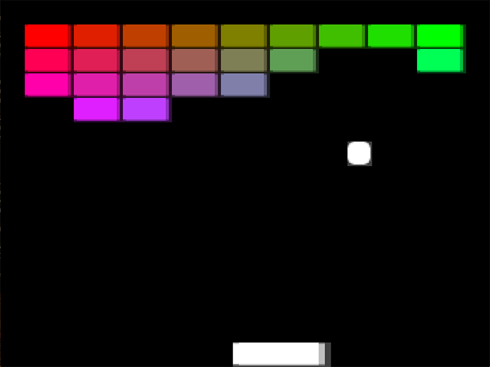
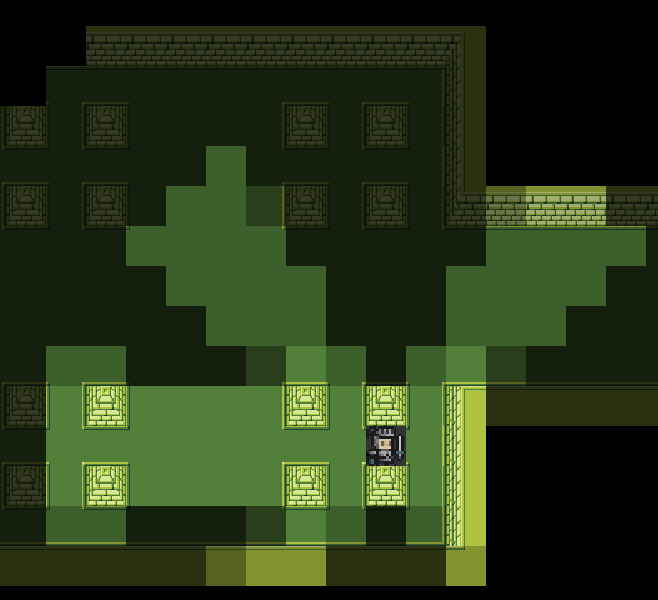

# Game Engine

This is an experimental cross-platform 2D game engine developed around Lua as both a scripting language and as a data description language.

I don't plan on continuing development of this engine as I was finding the tight coupling with the scripting language to be more restrictive than I'd like. Regardless, the scripting system turned out  rather flexible and I was able to prototype a variety of minigames with it.

Some parts may be interesting to look at on their own, like the Serializer which dumps the entire game state, including functions, closures, and metatables, to plain-text Lua script.

## Screenshots

*asteroid.lua*  


*breakout.lua*  


*dungeon.lua*  


*rouge.lua*  


*tetromino.lua*  


## Features

- Sprite and tilemap graphics
- Tile-based pathfinding and shadow casting
- Collision detection and limited physics (continuous, linear only)
- Serialize entire game state to Lua files
- Gamepad support through SDL and GLFW
- Limited audio support through SDL

## Getting Started

CMake 3+ is used for generating the build system. Unix Makefiles and Visual Studio generators have been tested on macOS and Windows respectively.

### Prerequisites

The engine can be built with SDL and GLFW as platforms, by setting the `USE_SDL` and `USE_GLFW` CMake options. SDL is recommended and is enabled by default. If built with both, the platform may be selected at runtime with command-line flags `-sdl` and `-glfw`.

### Building

On macOS, from the root folder:
```
mkdir build
cd build
cmake ..
cmake --build .
```

On Windows, use CMake GUI to generate a Visual Studio solution.

### Running

Run the engine with the path to a Lua script as a command-line argument. For example:
```
./engine asteroid.lua
```

If a file is not found at the specified path, the directories `scripts/` and `../scripts/` will be searched as well.

### Example Script

This example script creates a 3x3 unit **Canvas** with a single sprite (on an **Actor** objcet) drawn in the center.
```
local game = Canvas {
    camera = Camera2D {
        size = { 3, 3 },
        fixed = true
    }
}
addCanvas(game)

local hero = Actor {
    graphics = SpriteGraphics { sprite = "hero.tga" },
    transform = { position = { 1, 1 } }
}
game:addActor(hero)
```


More complex example scripts are included in the `scripts/` folder:

- *asteroid.lua* - space shooter game
- *bomb.lua* - Bomberman clone
- *breakout.lua* - Breakout clone
- *dungeon.lua* - timemap beautifier
- *painter.lua* - tilemap painter
- *pftest.lua* - pathfinding test
- *physics.lua* - physics test benches
- *platform.lua* - platformer test
- *rouge.lua* - Roguelike test
- *runner.lua* - endless running test
- *snake.lua* - multi-player Snake clone
- *test.lua* - self-reproducing serialization test
- *tetromino.lua* - a Tetris clone

## Scripting System

This section documents the features of the scripting system.

### Scene

The scene encompases the global table, list of **Canvas**es, and other bits of game state. The scene is not directly exposed to scripting, but a number of global functions are defined to interact with it.

The following libraries are available: base, table, io, os, string, math, utf8. Added global math constants `inf` and `nan`. The following global functions are defined:

- `addCanvas(canvas)` - add `canvas` to the scene (stacked on top of the previous)
- `loadClosure(string)` - load the Lua function encoded in `string` 
- `saveState()` - save the current scene as Lua script, currently written to stdout for development
- `playSample(string)` - play the audio clip with file name `string`
- `registerControl(string, function)` - register `function` to control named `string`
- `setPortraitHint(boolean)` - hint to the platform to use a portrait (`true`) or landscape (`false`) mode
- `quit()` - exit the application

### Canvas

**Canvas** is a game object that acts like a layer in a scene.

A **Canvas** is created by the `Canvas(table)` method. The shorthand `Canvas{key=val}` can be used as well. The following properties may be set in table:
- `camera` - a **Camera** specifying how to render the scene 
- `paused` - a `boolean` indicating if the **Canvas** is paused
- `visible` - a `boolean` indicating if the children of the **Canvas** will be rendered

The following methods are defined on **Canvas**:

- `addActor(actor)` - add `actor` to the **Canvas**
- `removeActor(actor)` - remove `actor` from the **Canvas** 
- `clear()` - remove all **Actor**s from the **Canvas** 
- `setCenter(actor / x, y)` - centers the camera on either `actor` or coordinates <`x`, `y`> 
- `setOrigin(x, y)` - places the upper left of the camera at coordinates <`x`, `y`>
- `getCollision(x, y)` - return the first actor to collide with coordinates <`x`, `y`>
- `setPaused(boolean)` - same as the `paused` property above
- `setVisible(boolean)` - same as the `visible` property above 

The following methods may be overloaded on **Canvas**:

- `onUpdatePre(number)` - called before physics and player updates, with `number` seconds elapsed since last frame 
- `onUpdatePost(number)` - called after physics and player updates, with `number` seconds elapsed since last frame
- `onClickPre(boolean)` - called before propagating mouse clicks, with `boolean` indicating press/release
- `onClickPost(boolean)` - called after propagating mouse clicks, with `boolean` indicating press/release 

### Camera2D

**Camera2D** is an implementation of **Camera** that can be set on **Canvas**.

TODO

### Actor

**Actor** is a game object that represents an entity on a **Canvas**. The **Actor** can be decorated with components that affect the appearance and behavior of the object.

TODO

### Input

Keyboard controls can be mapped to functions by calling `registerControl()`. The currently defined control names are 'up', 'left', 'down', 'right', 'w', 'a', 's', 'd', ```'action'```, and 'quit'. The cardinal directions and 'action' (`A` button) can be triggered by gamepads as well.

Mouse clicks can be received on **Actor**s by defining the `onClick()` function. **Canvas**es can also receive mouse clicks by defining `onClickPre()` and `onClickPost()` (which fire before and after mouse clicks are handled by children). If any of these objects return `true`, the event will be captured and not propagated further.

## Engine Architecture

TODO

## Authors

Trevor Smith - [LinkedIn](https://linkedin.com/in/trevorsm/)
